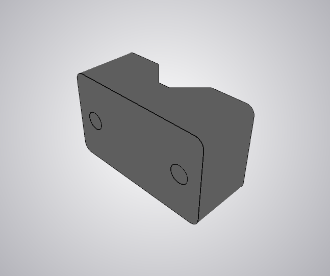
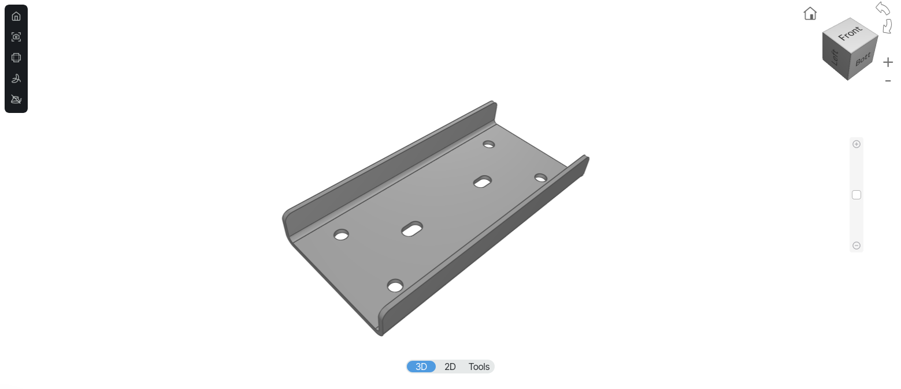
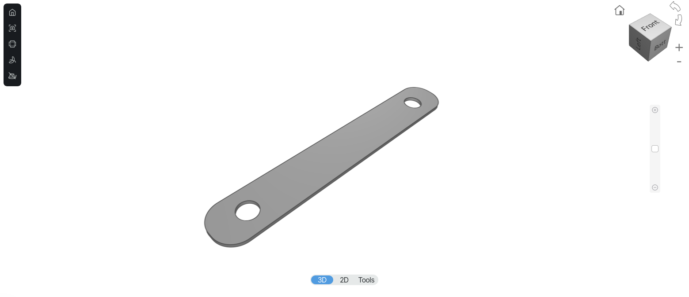
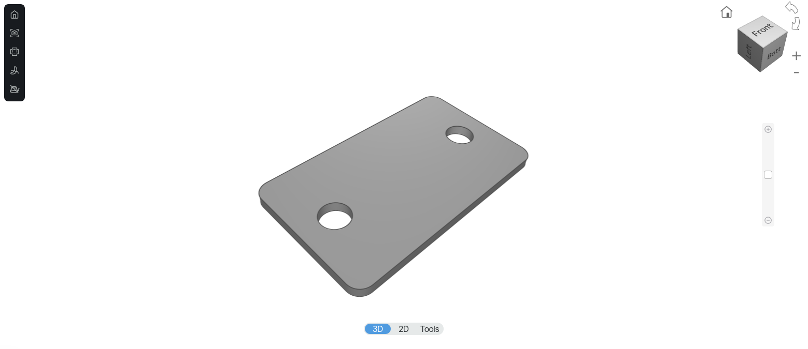
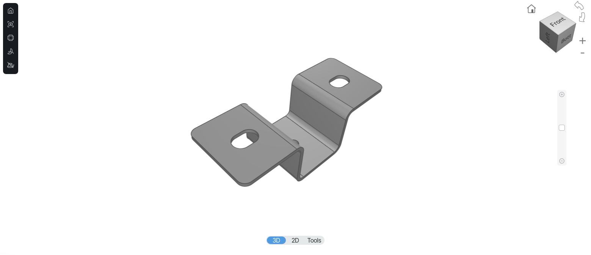
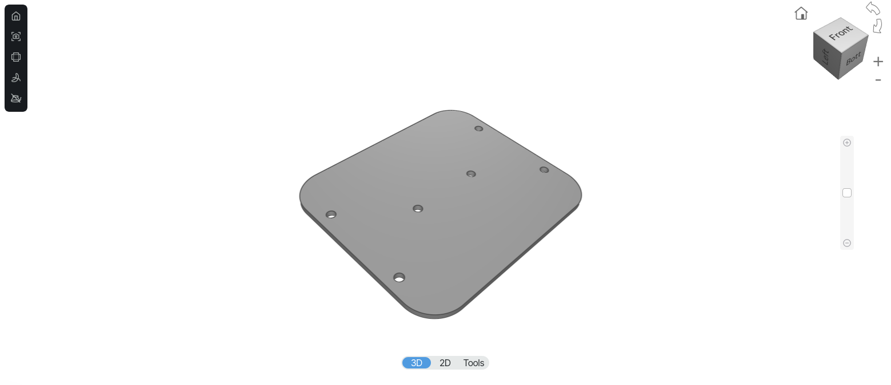

# 10-Meter Band Moxon Antenna

## CAD Files

This section contains the CAD files required to manufacture the custom parts used in the antenna assembly.

`FreeCAD` source files are provided for all custom parts and should be considered the primary editable design files. DXF and STL exports are also included for convenience and manufacturing reference.

The DXF files are intended primarily for 2D fabrication processes, while the STL files may be used for 3D printing or for viewing the part geometry in compatible software.

Images of the completed parts are provided below to illustrate their expected appearance after manufacturing.

Unless otherwise noted, dimensions and geometry should be taken from the `FreeCAD` source files.

---

<figure>
  
  <figcaption>Tube clamp (e)</figcaption>
</figure>

---

<figure>
  
  <figcaption>Tube mounting plate (f)</figcaption>
</figure>

---

<figure>
  
  <figcaption>Tube and Balun terminals (k, l)</figcaption>
</figure>

---

<figure>
  
  <figcaption>Clamp plate (d)</figcaption>
</figure>

---

<figure>
  
  <figcaption>Boom clamp (j)</figcaption>
</figure>

---

<figure>
  
  <figcaption>Balun mounting plate (g)</figcaption>
</figure>

---

