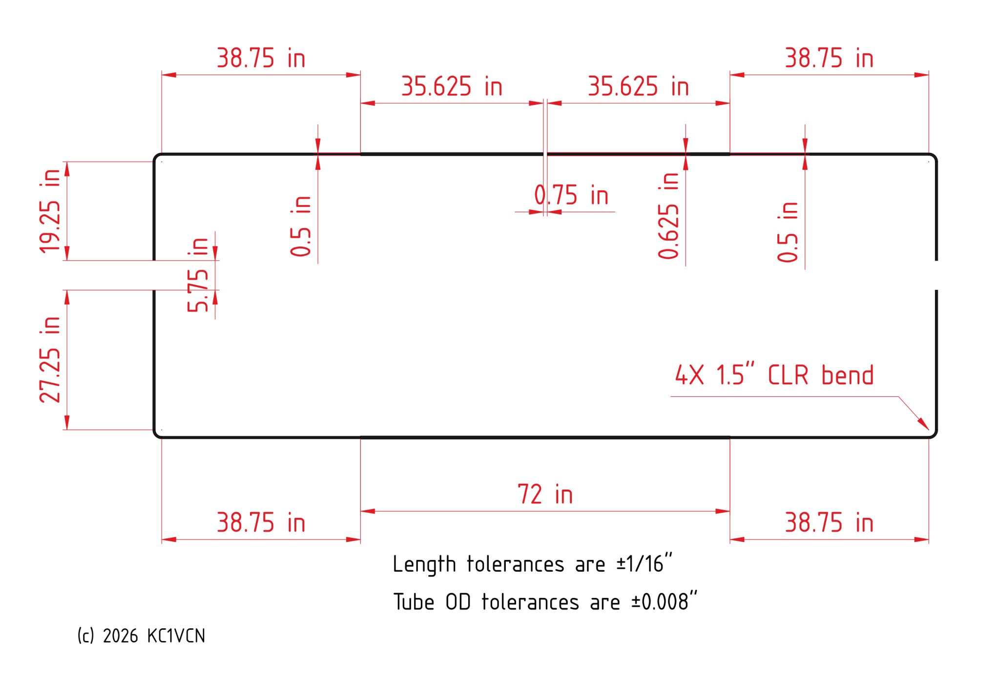
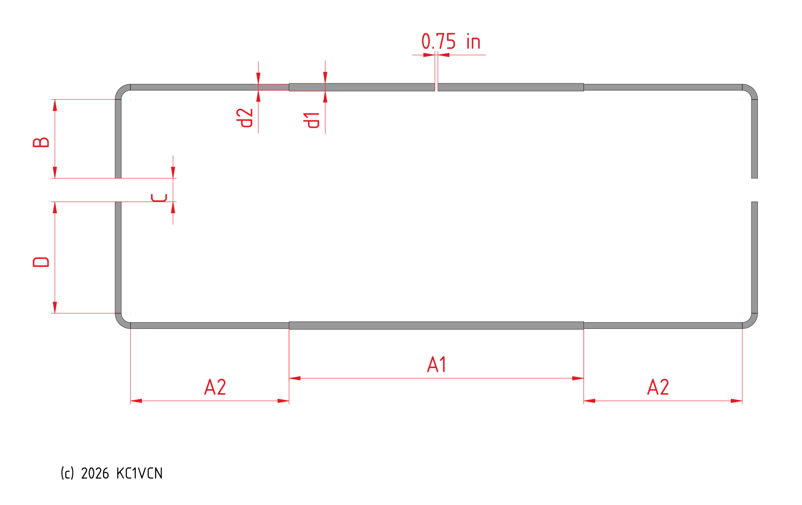
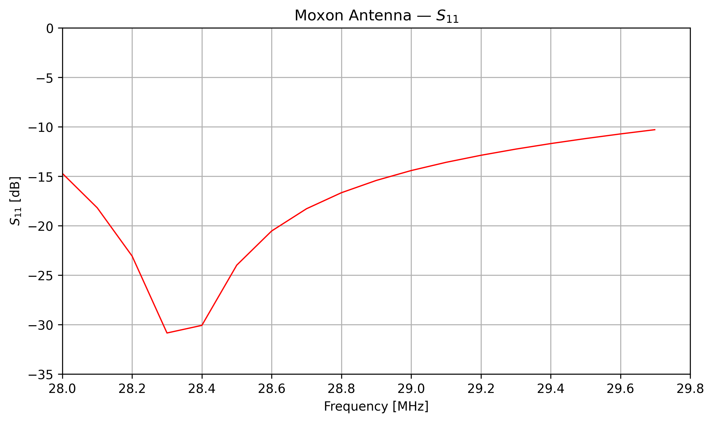
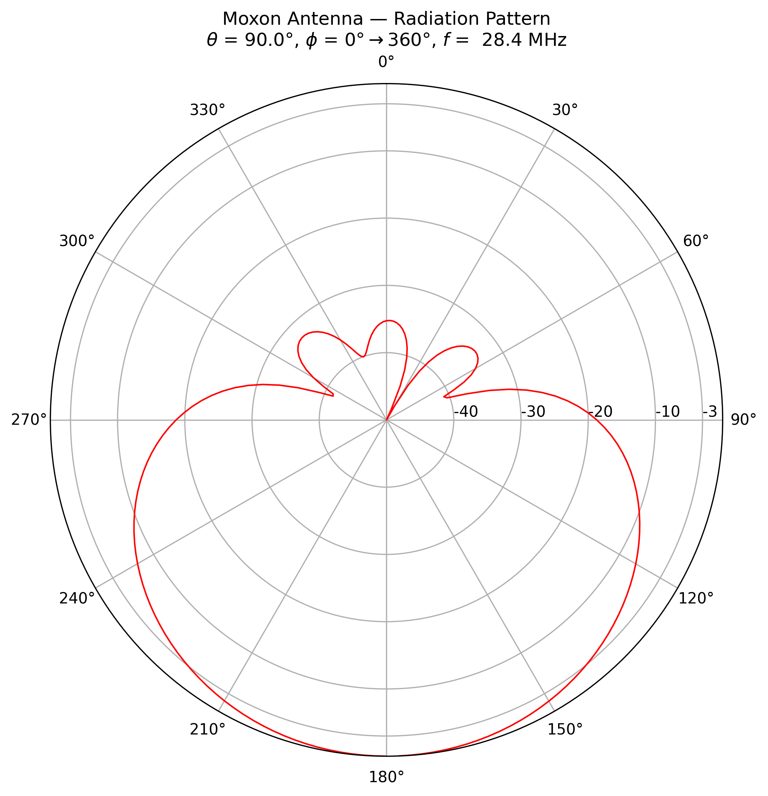
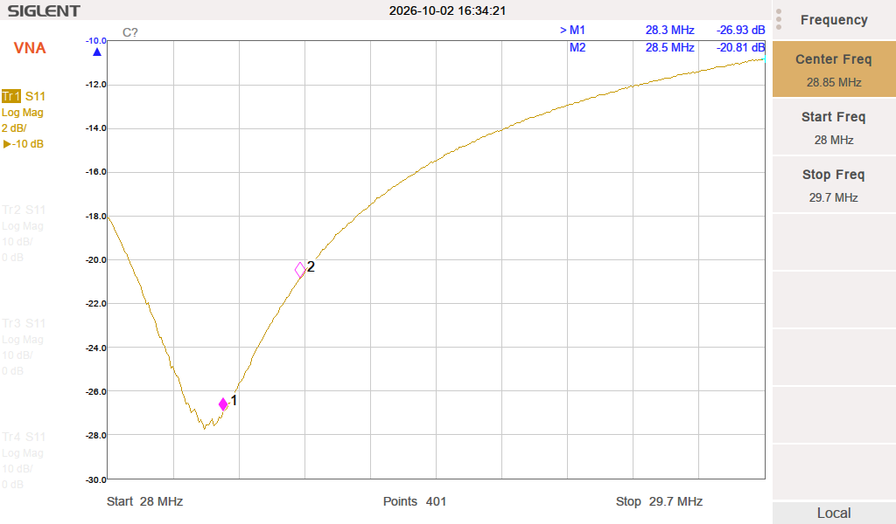
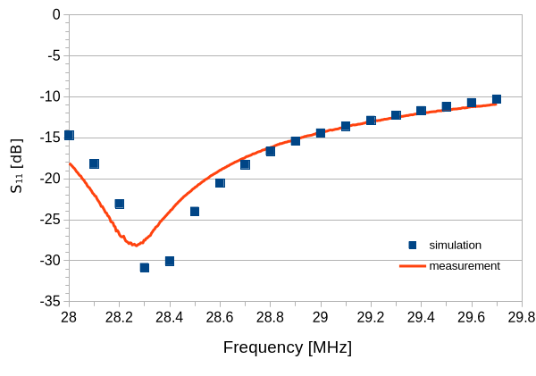

# 10-Meter Band Moxon Antenna

## Introduction

A Moxon antenna is a two-element beam antenna that uses enhanced capacitive coupling between the driven and parasitic elements. This coupling is achieved by bending the ends of both elements 90&#176; toward each other to form a rectangle. Hence, the antenna is also commonly referred to as a "Moxon Rectangle." Compared with a 2-element Yagi, the Moxon antenna has nearly 25% less width while providing nearly the same amount of gain and an excellent front-to-back ratio. Its input impedance is also naturally close to 50 Ohm. Typically, the bent ends of the elements are connected with insulating rods to complete the rectangle. This provides a more rigid structure and improves stability under wind loading.

The Moxon antenna was invented by Les Moxon, G6XN. A substantial amount of literature is available on the Moxon antenna, and several useful references are listed below:

1. Les Moxon, G6XN, *HF Antennas for All Locations*, Second Edition, Radio Society of Great Britain.

2. L. B. Cebik, W4RNL, *Moxon Rectangles and Online Calculator*, https://antenna2.github.io/cebik/content/moxon/moxpage.html

3. L. B. Cebik, W4RNL, *The Moxon Rectangle: A Review*, https://antenna2.github.io/cebik/content/moxon/mox20.html

4. L. B. Cebik, W4RNL, *An Aluminum 2-Element Moxon Rectangle 10m*, https://antenna2.github.io/cebik/content/moxon/mox.html

5. *The ARRL Antenna Book*, Chapter 13: HF Beam Antennas, page 13.32, 25th Edition.

---

## Construction

In this section, the construction of the antenna is described. Throughout the text, letters shown in parentheses refer to the corresponding reference indicators in the figures or the parts list.

A picture of the antenna is shown in Fig. 1. The antenna is constructed using telescoping aluminum tubes (*a*1, *a*2, *b*1&ndash;*b*4). The low weight and oxidation resistance of aluminum make it an ideal material for HF antenna construction. The driven (*a*1, *b*1, *b*3) and parasitic (*a*2, *b*2, *b*4) elements are held together by a boom made from a square aluminum tube (*c*).

<figure>
  
  <figcaption><b>Figure 1:</b> 10-meter Moxon antenna.</figcaption>
</figure>

The dimensions of the constructed antenna are given in Fig. 2. The starting point of the design is the example given in *The ARRL Antenna Book*, 25th Edition, page 13-32. Because the diameters and lengths of the aluminum tubes used here differ from those in the published example, the antenna dimensions were adjusted using a full-wave simulator to obtain acceptable return loss and front-to-back far-field ratio in the 10-meter band.

<figure>
  
  <figcaption><b>Figure 2:</b> 10-meter Moxon antenna dimensions.</figcaption>
</figure>

A parts list is provided in the repository in both PDF and spreadsheet formats. Two types of parts are required to construct the antenna: parts that can be purchased from online vendors (e.g., tubes and screws), and parts that must be manufactured. For purchased parts, recommended vendors and part numbers are provided. For manufactured parts, the corresponding CAD file names are listed and can be found in the repository. To assist the builder, recommended online vendors capable of manufacturing these parts are also included.

Construction steps are outlined below:

1. Clean all tubes with 90% isopropyl alcohol to remove grease and dirt.
2. Bend the smaller-diameter tubes (*b*1&ndash;*b*4) to obtain the prescribed tail lengths.
3. Cut one of the 6' long larger-diameter tubes (*a*1) in half using a tube cutter. These sections will be used as the left and right driven elements.
4. Cut slits into one end of the larger-diameter tubes (*a*1) using a hacksaw blade.
5. De-burr and lightly smooth all tube ends using a tubing reamer as needed.
6. Prepare the feed assembly, clamp the larger-diameter tubes (*a*1), attach the assembly to the boom, and connect the balun.
7. Prepare the parasitic-element support assembly, clamp the larger-diameter tube (*a*2), and attach it to the boom.
8. Mark the center of the stiffening rod and insert it inside the driven elements until it is symmetric with respect to the feed point.
9. Insert the smaller-diameter tubes (*b*1&ndash;*b*4) into the larger-diameter tubes (*a*1, *a*2) to obtain the prescribed element lengths.
10. Insert the spacer rods into the tail ends and fasten them to the tubes to obtain the prescribed tail gap.
11. Attach the antenna to a mast at its center of gravity using a mast clamp.

> [!NOTE]
> All tube bends should be made using a lever-style tube bender with a 1.5-inch CLR (Center Line Radius). Care must be taken not to crack or collapse the tubes during bending. Therefore, the use of a good-quality lever-style tube bender is important.
>

> [!TIP]
> It is best to carry out the construction on a good, flat surface such as a garage floor.
>

In the following paragraphs, the construction steps are explained in greater detail.

---

### Antenna Feed

This assembly is where the left and right driven elements are connected to the balun terminals and clamped to the boom. Pictures of the antenna feed section are given in Figs. 3 (with balun) and 4 (close-up).

<figure>
  
  <figcaption><b>Figure 3:</b> Detailed view of the antenna feed (with balun).</figcaption>
</figure>

The left and right driven elements are mounted to a stainless-steel mounting plate (*f*) using polycarbonate tube clamps (*e*) manufactured by FDM (Fused Deposition Modeling). These clamps are bolted down using pan-head screws (*o*) and stainless-steel compression plates (*d*) to provide uniform pressure across the polycarbonate. The screws must be tightened sufficiently to hold the aluminum tubes straight, but they should not be over-tightened. The plate (*f*) is attached to the boom (*c*) using bracket (*j*) and tap bolts (*n*).

The balun plate (*g*) is first attached to the boom using another bracket (*j*) and flat-head screws (*q*). The flat-head screws used to attach the balun plate to the boom bracket are not visible in the picture because they are located under the balun in the final assembly. To ensure that the balun sits flush on the plate, the plate holes should be chamfered to receive the flat-head screws. The 1:1 balun (*h*) is then attached to plate (*g*) using pan-head screws (*r*).

> [!NOTE]
> The height and spacing of the balun terminals should be selected so that, when the balun is mounted, the terminals align with the aluminum-tube contacts as shown in the figures.
>

> [!NOTE]
> The antenna is mounted with the balun facing downward to prevent the accumulation of snow and ice around the feed structure.
>

A 50" long fiberglass stiffener rod (*m*) is inserted inside the larger aluminum tubes from one of the open ends. This stiffener is placed only inside the larger tubes and does not extend into the smaller end tubes. Its purpose is to provide additional mechanical rigidity and damp mechanical oscillations that may occur under wind loading. The rod should be centered to leave sufficient room for the smaller-diameter tubes to slide inside the larger-diameter tubes.

<figure>
  
  <figcaption><b>Figure 4:</b> Detailed view of the antenna feed (close-up).</figcaption>
</figure>

Contacts for the aluminum tubes are made using 1/2" wide aluminum strips (*k*) wrapped around the tubes to form loop clamps. Connections between the tube contacts and balun terminals are made using the same 1/2" wide aluminum strips (*l*), which are attached to the loop clamps using pan-head screws (*p*). A PVC dielectric (*i*) is placed between the terminal strips (*l*) to lower the impedance closer to 50 Ohm.

The mounting plate (*f*) is attached to the boom (*c*) using a boom bracket (*j*). The same bracket is also used to attach the balun plate (*g*) to the boom.

> [!NOTE]
> The balun shown in the picture is a custom-designed balun housed in a 4"&#xD7;4"&#xD7;2" PVC NEMA box. Similar baluns can be purchased from online stores, and an example is provided in the parts list.
>

The input UHF connector of the balun should be weatherized using self-fusing silicone tape.

> [!NOTE]
> Self-fusing silicone tape does not contain an adhesive for sticking. It should be stretched during application to activate the tape surface and enable self-fusing. After approximately 24 hours, the tape layers will fuse into a single block, providing waterproof insulation.
>

### Parasitic Element Support

This assembly is where the parasitic element is clamped to the boom. A picture of the parasitic-element support is shown in Fig. 5.

<figure>
  
  <figcaption><b>Figure 5:</b> Parasitic element support.</figcaption>
</figure>

To keep the driven- and parasitic-element planes aligned, the same mounting approach used for the driven elements is also used here, with polycarbonate tube clamps (*e*) and the stainless-steel mounting plate (*f*).

A polyethylene square plug (*w*) is placed at both ends of the boom to seal the square tube from the elements.

### Tube Connections

This assembly is where the larger-diameter tubes are connected to the smaller-diameter tubes. A picture of the tube connections is shown in Fig. 6.

<figure>
  
  <figcaption><b>Figure 6:</b> Tube connections.</figcaption>
</figure>

The tubes should be cleaned before assembly to remove grease and residue that could otherwise inhibit a good electrical connection. Note that the excess length of the smaller-diameter tubes can remain inside the larger-diameter tubes.

To facilitate the connections, 3/4" long slits are cut along the connecting ends of the larger-diameter tubes (*a*) to receive the smaller-diameter tubes (*b*). Typically, four slits spaced 90 degrees apart are used. In this case, two slits are also sufficient because the smaller-diameter tubes fit snugly inside the larger-diameter tubes; therefore, little flexing of the slitted ends is required. A hacksaw with a blade thickness of 1/32" can be used to make the cuts. Care must be taken to cut the slits as straight as possible.

> [!TIP]
> Cutting straight slits along the length of the tubes can be tricky. The use of a simple jig is recommended, as is practicing first on a disposable piece of aluminum tube.
>

Stainless-steel hose clamps (*y*) are used to compress tubes (*a*) over the slits and secure tube (*b*). The clamps should be tightened while the antenna is resting on a good, flat surface (e.g., a garage floor) to maintain antenna planarity; otherwise, the tube ends may droop.

> [!NOTE]
> Aluminum flashing that is 1" wide and 1/64" thick can be wrapped over the slits before installing the hose clamps to provide resistance to water intrusion. The hose clamps will compress the flashing and the slitted tube together, squeezing the smaller-diameter tube and forming the electrical connection.
>

### Tube-End Spacers

Tube-end spacers are used to keep the ends of the tubes at a precise distance from each other. They also stabilize the antenna rectangle. A picture of the tube-end spacers is shown in Fig. 7.

<figure>
  
  <figcaption><b>Figure 7:</b> Tube-end spacers.</figcaption>
</figure>

The ends of the tubes (*b*) should be drilled 1.5" from the edge using a 9/64" drill bit, as shown in the figure. A pre-drilled fiberglass rod (*x*) is then inserted inside the tubes, and machine screws (*s*) are used to hold the tubes and rod together. The separation between the drill holes in the rod should be 5.75"+1.5"+1.5" so that, when the rod is inserted into the aluminum tubes and fastened, the gap between the tube ends is exactly 5.75".

> [!TIP]
> To drill the aluminum tubes and rods accurately and perpendicular to their surfaces, a drill guide can be used.
>

---

## Full-wave Electromagnetic Simulations

It is useful to perform full-wave electromagnetic simulations of the antenna structure before assembling the physical antenna. For this purpose, an open-source 3D finite-element solver called Palace (Parallel Large-scale Computational Electromagnetics) was used (https://awslabs.github.io/palace/stable/). Palace has been developed by the Amazon Web Services (AWS) Center for Quantum Computing. The simulation software was installed on a virtual machine (VM) using Microsoft Azure Cloud Computing Services. The simulations were performed on an E4_v4 virtual machine with 4 vCPUs and 32 GB of RAM. One advantage of cloud computing is that the available compute resources, such as RAM and CPU cores, can be scaled according to model complexity.

<figure>
  
  <figcaption><b>Figure 8:</b> Aluminum-tube Moxon antenna model showing the simulation parameters.</figcaption>
</figure>

<table style="width: 600px;">
  <caption></caption>
  <thead>
    <tr>
      <th>A1</th>
      <th>A2</th>
      <th>B</th>
      <th>C</th>
      <th>D</th>
      <th>d1</th>
      <th>d2</th>
    </tr>
  </thead>
  <tbody>
    <tr>
      <td>72"</td>
      <td>38.75"</td>
      <td>19.25"</td>
      <td>5.75"</td>
      <td>27.25"</td>
      <td>0.625"</td>
      <td>0.5"</td>
    </tr>
  </tbody>
</table>

The antenna geometry is generated programmatically using a Python script. The script reads the main antenna parameters (*A*1, *A*2, *B*, *C*, *D*) from an Excel worksheet and generates the corresponding mesh files. The mesh files are then used as input to the Palace simulator. The benefit of using a worksheet is that multiple geometry variations can be listed, allowing a simulation to be submitted simply by specifying a row index and thereby enabling automation. The antenna dimensions were optimized to provide good return loss and front-to-back (F/B) far-field ratio over the desired frequency band.

<figure>
  
  <figcaption><b>Figure 9:</b> Simulated S11 of the 10-meter Moxon antenna.</figcaption>
</figure>

<figure>
  
  <figcaption><b>Figure 10:</b> Simulated normalized far-field of the 10-meter Moxon antenna.</figcaption>
</figure>

---

## Measurement Results

The measured return loss (*S*11) of the antenna is shown in Fig. 11. The measurements were made using a network analyzer while the antenna was mounted approximately 23 feet above ground on a fiberglass push-up pole. The measurement setup was located at the bottom of the pole. Therefore, the results include the effects of the connecting RG-8X coaxial cable, RF connectors, and the 1:1 balun. A more accurate characterization of the antenna itself could be obtained if the balun were characterized and tuned separately; however, time and resource limitations did not allow this.

<figure>
  
  <figcaption><b>Figure 11:</b> Measured S11 of the 10-meter Moxon antenna.</figcaption>
</figure>

The return loss of the antenna is excellent between 28.3 and 28.5 MHz, which is the portion of the 10-meter band reserved for amateur SSB communications in the U.S. If desired, the return-loss minimum can be shifted to another portion of the band by re-optimizing the dimensions. Note that, although the return loss is relatively broadband across the band, the front-to-back ratio is more sensitive to operating frequency.

A comparison of the simulated and measured antenna responses is shown in Fig. 12. As can be seen from the plots, the measurement and simulation agree relatively well. The discrepancy around the *S*11 dip can be attributed to the effects of the balun and feed structure.

<figure>
  
  <figcaption><b>Figure 12:</b> Simulation vs. measurement of the 10-meter Moxon antenna.</figcaption>
</figure>

---

## License

The hardware design, geometry-generation source code, simulation input files, and other source material in this repository are licensed under the **CERN Open Hardware Licence Version 2 – Weakly Reciprocal (CERN-OHL-W-2.0)**, unless otherwise noted.

Commercial use is permitted under the terms of CERN-OHL-W-2.0. Modified Covered Source must retain the applicable Notices and include the modification notice required by the license, including the date and a brief description of the modifications. Products made using the Covered Source must provide the Complete Source or identify the Source Location as required by the license.

The full license text is provided in the [`LICENSE`](LICENSE) file, and project-specific attribution and Source Location information are provided in the [`NOTICE`](NOTICE) file.

Third-party software used with this project, including Palace and Gmsh, is not part of the Covered Source in this repository and remains subject to its respective license.

